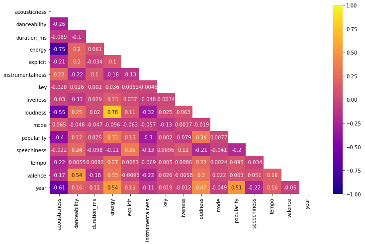
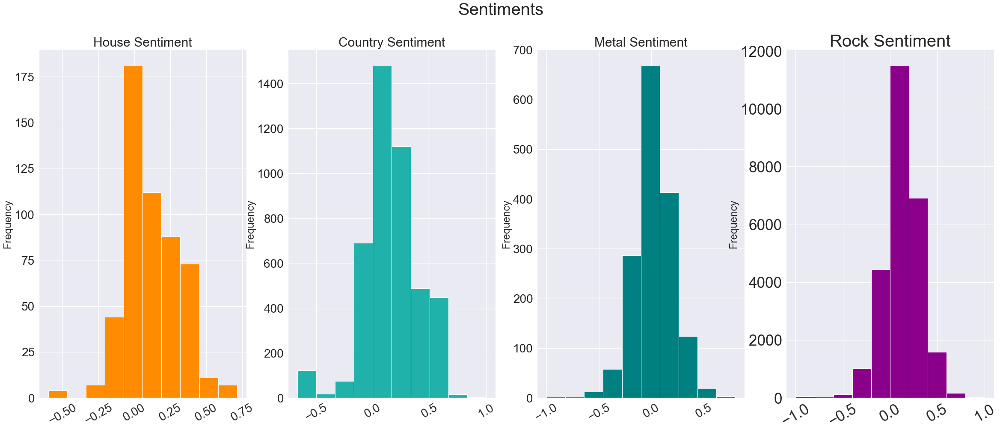

# Genre Classification on Lyrics and Audio Attributes
---
This project aimed to create two machine learning classifiers that predicts the genre of a song after inputting lyrics as well as by using the audio qualities. This project will use datasets from Kaggle and data scraped from genius.com.

Problem statement: Can we build a model that uses various lyrics and audio attributes to accurately predict the genre of a song?

This project consists of 3 notebooks and 3 main sections: Data gathering for lyrics, EDA (exploratory data analysis) and Modeling. 

### Repository Organization
* The included notebooks are `Audio_Data_Modeling.ipynb`, `Lyrics_Data_Gathering_Preprocessing.ipynb`, `Lyrics_Data_Modeling_.ipynb` . This is where all project work was done from start to finish in that order.

* Data Folder: Consists of gathered data, scraped data, cleaned data, word count data and concatenated data.
* README file: Contains the project overview and executive summary.
* PDF Presentation: Contains information on the project in presentation form.

## Prerequisites and Requirements
---
The following Python libraries were used in this project

* Numpy
* pandas
* requests
* matplotlib
* seaborn
* NLTK
* regex
* collections
* requests
* logging
* time
* re
* plotly
* random
* sklearn
* textblob
* pickle
* string
* itertools
* pprint
* gensim
* lyricsgenius

## Data Collection, Preprocessing and EDA
---

For my data, I gathered two datasets (data.csv and data_by_genres.csv) from Kaggle consisting of spotify song data. these data sets can be found here: https://www.kaggle.com/yamaerenay/spotify-dataset-19212020-160k-tracks?select=data.csv
I also gathered additional lyric data from kaggle located here: https://www.kaggle.com/neisse/scrapped-lyrics-from-6-genres?select=lyrics-data.csv
For the song lyrics that I did not have, I scraped my data from genius.com using `lyricsgenius` which can be downloaded using the anaconda prompt. This data was pushed through a function that iterated each artist in my dataset and scraped the song listed in their indexed row. The songs were then appended to a dictionary and the dictionary was later appended to my other cleaned datasets.

we use `re.sub` to remove special characters and keep only upper and lower case letters. The words are then converted to all lowercase. *Stop words* are defined by using nltk and and then used to remove the stop words in each dataframe. Lastly, the `cleanup` function lemmatizes the words and joins them back together.

A tokenizer function was then used to see the relationships between words better. Both functions helped in converting the data into a new, cleaned dataframe. Furthermore, The additional lyrics data gathered from Kaggle was merged with the cleaned lyrics dataset to give more accuracy for each artist and their distinct songs.

For my audio and lyrics data, I stripped the necessary columns of brackets and quotations. I also dropped the NaN values and removed any dupicate values that consisted of duplicate rows with artist information. I also dropped unneccessary columns and features that had little to no impact on my data (such as *year*, *artist id*, and *song links*).
I used sentiment analysis and word2vec as well as doc2vec to view the relationship among my lyrics data. These allowed me to explore word similarities among genres and how those related to each other. I also used `t-SNE` and `plotly` for visualizations and I was able to train my word2vec and doc2vec models on these newly made text corpuses.

## Modeling and Methodology
---
For my baseline model, I used a Decision Tree Classifier to help in informing me of which columns play a part in classifying my data. I chose this because a decision tree model does not require scaling and the model is generally extremely intuitive. I also used the bagging method to help in creating an ensemble of multiple models to build an overall model. 

I also used a random forest classifier to stay on trend with the bagged decision trees. The difference is that the random forest will split on a randomized subset of features. I then added a Grid Search component to produce the optimum score using my hyperparameters.

My best model for my audio data and my lyrics data were both the Random Forest Classifiers with the addition of Gridsearch. The decision tree models (both bagged and unbagged) performed much worse than the Random Forest Models, though there was virtually no overfitting on them. Our random forest-gridsearch models were roughly 13% overfit both each time.

# Conclusions and Recommendations
---
Our best model for our genre classification using audio attributes ended up being the Random Forest Classifier. Our final train score was at 70% while our test score was at 57%. Our best model was still overfit by 13%, and though we tried an array of different methods and hyperparameter tuning to increase our score, there was little to no improvment. In reviewing our EDA elements we can see that our features were what largely impacted the models performance. Even after adjusting hyperparameters, our model's score was still relatively the same. To combat this, I adjusted the features further, but the results still came out similarly.

As concluded from our prior model in our audio notebook, our random forest model scored highest out of the 3 models we trained. Our lyrics classifier is still 13% overfit however. A positive is that this classifier (using lyrics to train), scored higher on our testing set than in our audio classifier testing set, so we know that our feature selection was better here. Our decision tree models scored roughly the same and were very low even still. That leads me to belive those models just werent the best fit for this specific project. Our decision tree models were not nearly as overfit as our random forest model. The margin of erro is next to none, however, I would need to do more exploration on why these models scored poorly if I wanted to revisit training them. In our classification report, we see that our precision and our recall are closer in range for our random forest model. Aside from genres 7 and 10, our model performed much better in terms of predicting actual truths and actual false values.

### Recommendations

The next steps for our audio classifier would be to revisit our features and genre classes and how they were classified. The classification system used can be improved by exploring the audio quality levels themselves and classifiying the songs by these levels. Largely, what we would need to improve is how we explore our features and the methods used to feed into the model.
Our NLP analysis pointed out a few key things. The first is that there was an error in not omitting spanish or latin stop words. These showed up in our plots and they dominated our word count for the latin genre. There was also word overlap in the classical and latin genres. I suspect this was due to our previous genre classification method and how these songs were categorized. Revisiting the features and methods of classification is necessary to improve our scores.

Since we stripped our classifier of all audio attributes, we did not get a chance to run it in tandem with our audio features model. It would be beneficial to combine both datasets and run another model that allowed for the training on a master dataset. This would be best to do after features are revisited and explored more, as to optimize our models score.

Cleaning up our stop words would give us a better corpus to train on. The addition of the stops words from other languages would give us different results for our eda.

Combining an ensemble model would also be another way of improving our score. Rather than combining our datasets, our models could be combined for another score. This can be done before feature exploration or now with the models we have trained.

Ultimately, our lyrics classifier and our Audio classifier are promising, but feature selection and exploration are necessary if we want this to become a reliable way to predict genres of songs.